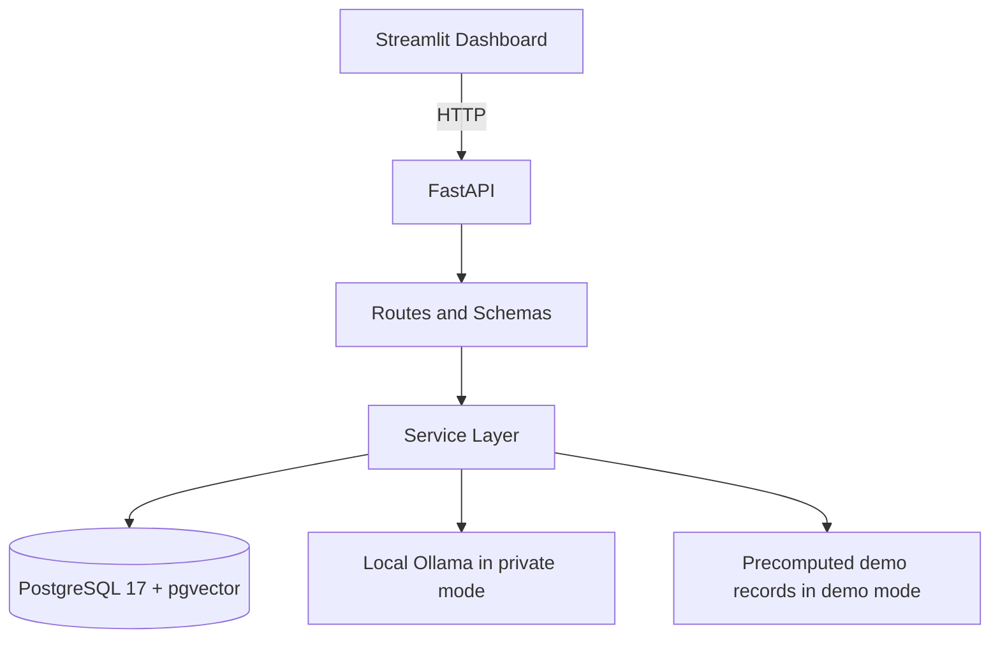

# AI Job Hunter CRM

AI Job Hunter CRM is a local-first, privacy-aware job-search workspace. It combines
candidate and job management, deterministic parsing, explainable scoring, optional
local semantic similarity, grounded tailoring suggestions, and application tracking
behind a FastAPI backend and a polished Streamlit dashboard.

The project supports two explicit modes:

- `APP_MODE=local`: full private application for the owner's real job search data.
- `APP_MODE=demo`: read-only public portfolio demo with fictional, precomputed data.

## Problem Solved

Job seekers often scatter job postings, requirements, application status, notes,
and tailoring drafts across spreadsheets, documents, and browser tabs. This makes
it hard to compare fit, preserve truthful evidence, and track progress.

AI Job Hunter CRM centralizes that workflow while keeping private résumé and job
data under the user's local control.

## Key Features

- Candidate profile CRUD with private résumé text in local mode.
- Job posting CRUD with deterministic parsing of skills, experience, and education.
- Shared normalized skill catalog with alias matching.
- Candidate résumé parsing without modifying the original candidate profile.
- Explainable deterministic match scoring with component scores and missing skills.
- PostgreSQL pgvector-backed embeddings and separate semantic similarity results.
- Local Ollama generation for evidence-backed summaries, bullets, and cover letters.
- Application tracking with five statuses and status history.
- Streamlit dashboard that talks only to FastAPI.
- Read-only fictional demo mode that does not require Ollama.
- Docker support for PostgreSQL 17 + pgvector, FastAPI, and Streamlit.

## Screenshots

Screenshots should be captured manually from the fictional demo only. See
[docs/screenshots/README.md](docs/screenshots/README.md).

## Architecture



See [docs/architecture.md](docs/architecture.md) for the full architecture notes.

## Technology Stack

- Python 3.10
- FastAPI and Uvicorn
- Streamlit
- SQLAlchemy ORM
- Alembic
- PostgreSQL 17
- pgvector
- Psycopg 3
- HTTPX / HTTPX2
- Pydantic settings
- pytest
- Docker Compose
- Optional local Ollama models: `nomic-embed-text`, `qwen3:4b`

## Local/Private Mode

Local mode is the default.

```env
APP_MODE=local
```

Local mode is writable and can store real candidate, résumé, job, application, and
generated tailoring data in the configured PostgreSQL database. It has no
authentication and must not be exposed publicly.

## Read-Only Demo Mode

Demo mode is for portfolio browsing.

```env
APP_MODE=demo
```

Demo mode:

- uses a separate demo PostgreSQL database and volume;
- displays a persistent `Demo Mode` badge;
- contains fictional data only;
- blocks public HTTP writes with `403 Demo mode is read-only`;
- shows precomputed matches, semantic scores, embeddings, and tailoring;
- does not require public Ollama access.

Demo reset is intentionally CLI/container-startup only. There is no public reset
endpoint. See [docs/demo-guide.md](docs/demo-guide.md).

## Quick Start

Local Docker:

```powershell
docker compose up --build
```

Demo Docker:

```powershell
docker compose -f docker-compose.demo.yml up --build
```

Open:

- Frontend: <http://127.0.0.1:8501>
- API docs: <http://127.0.0.1:8000/docs>
- API health: <http://127.0.0.1:8000/health>
- API readiness: <http://127.0.0.1:8000/ready>
- App mode: <http://127.0.0.1:8000/app-info>

## Docker Local Setup

`docker-compose.yml` starts:

- PostgreSQL: `pgvector/pgvector:0.8.3-pg17-trixie`
- backend: FastAPI, migrations, optional local Ollama connectivity
- frontend: Streamlit

Local PostgreSQL data uses the named volume:

```text
ai_job_hunter_postgres_data
```

Do not run `docker compose down -v` unless you intend to remove local data.

## Docker Demo Setup

`docker-compose.demo.yml` starts a separate demo stack:

- separate database: `demo_jobhunter`
- separate credentials
- separate volume: `ai_job_hunter_demo_postgres_data`
- `APP_MODE=demo`
- `DEMO_SEED_ON_STARTUP=true`

The demo database does not publish PostgreSQL to the host. Demo browsing does not
depend on Ollama.

## Manual Setup

```powershell
python -m venv .venv
.\.venv\Scripts\Activate.ps1
python -m pip install -r requirements.txt
```

Create `.env` from `.env.example`, then run:

```powershell
python -m alembic upgrade head
python -m uvicorn backend.main:app --reload
```

In another terminal:

```powershell
python -m streamlit run frontend/app.py
```

## Ollama Setup

Local/private AI features are optional. Install these models locally if you want
live embeddings and tailoring:

```powershell
ollama pull nomic-embed-text
ollama pull qwen3:4b
```

For Docker on Windows/macOS:

```env
OLLAMA_BASE_URL=http://host.docker.internal:11434
```

On Linux, use Docker's `host-gateway` mapping as shown in `docker-compose.yml`.
Do not expose Ollama publicly.

## Environment Variables

| Variable | Default | Notes |
| --- | --- | --- |
| `APP_MODE` | `local` | `local` or `demo` |
| `DEMO_SEED_ON_STARTUP` | `false` | Only valid for demo startup seeding |
| `DATABASE_URL` | required | PostgreSQL SQLAlchemy URL |
| `API_BASE_URL` | `http://127.0.0.1:8000` | Frontend to backend URL |
| `FRONTEND_REQUEST_TIMEOUT_SECONDS` | `120` | Streamlit HTTP timeout |
| `EMBEDDING_PROVIDER` | `ollama` | Local provider only |
| `EMBEDDING_MODEL` | `nomic-embed-text` | Optional local Ollama model |
| `GENERATION_PROVIDER` | `ollama` | Local provider only |
| `GENERATION_MODEL` | `qwen3:4b` | Optional local Ollama model |
| `OLLAMA_BASE_URL` | `http://localhost:11434` | Never expose publicly |

`.env` is ignored by git.

## Migrations

Alembic is the only schema-management system. Do not use
`Base.metadata.create_all()`.

```powershell
python -m alembic upgrade head
python -m alembic current
```

The final migration head is:

```text
20260625_0010 (head)
```

Migration `0010` adds demo markers only to root records:

- `candidate_profiles`
- `job_postings`
- `applications`

The shared `skills` table is intentionally not demo-owned.

## Demo Seeding

Seed:

```powershell
python -m scripts.seed_demo
```

Reset only demo roots and recreate:

```powershell
python -m scripts.seed_demo --reset
```

The seed process is deterministic, idempotent, transactional, and avoids logging
résumé text, job descriptions, or generated content.

## Testing

```powershell
python -m pytest -q
```

Useful targeted commands:

```powershell
python -m pytest -q tests/unit/test_app_mode.py tests/test_app_info.py
python -m pytest -q tests/integration/test_demo_restrictions.py
python -m pytest -q tests/integration/test_demo_seed.py
```

Automated tests use fictional fixtures and fake providers. CI does not require
Ollama or cloud credentials.

## Privacy and Security

See [docs/privacy.md](docs/privacy.md).

Important points:

- local mode can store private résumé and job data;
- demo mode must use a separate database and fictional records;
- no cloud AI provider is required;
- public demo mode is read-only;
- private local mode has no authentication and must not be exposed publicly.

## API Overview

Core API groups:

- `GET /health`
- `GET /ready`
- `GET /app-info`
- `/candidates`
- `/jobs`
- candidate/job parsing endpoints
- embedding and semantic-match endpoints
- deterministic matching endpoints
- tailoring endpoints
- `/applications`

FastAPI docs are available at `/docs` while the backend is running.

## Project Structure

```text
backend/       FastAPI routes, schemas, ORM models, services
frontend/      Streamlit dashboard and API client
migrations/    Alembic migrations
scripts/       Backend startup and demo seed CLI
tests/         Unit and PostgreSQL integration tests
docs/          Architecture, demo, privacy, and portfolio docs
```

## Design Decisions

- Local-first by default.
- Demo mode is read-only rather than publicly mutable.
- Deterministic scoring remains separate from semantic similarity.
- Tailoring is validated against candidate evidence.
- Demo output is honestly labeled as precomputed.
- PostgreSQL and pgvector are used directly; no separate vector database.

## Limitations

- No authentication or multi-user support.
- No scraping or automatic applications.
- No email, notifications, payments, DOCX/PDF export, or browser extension.
- Demo reset is CLI/container-startup only.
- Local Ollama quality depends on locally installed models.

## Future Improvements

- Authentication for a hosted private version.
- Multi-user workspaces.
- Job-board integrations with explicit user control.
- Notifications and reminders.
- Résumé version history.
- Export workflows.

## Portfolio Outcomes

See [docs/case-study.md](docs/case-study.md) and
[RELEASE_NOTES.md](RELEASE_NOTES.md) for the recruiter-facing case study,
verified metrics, release checklist, and suggested `v1.0.0` packaging.
