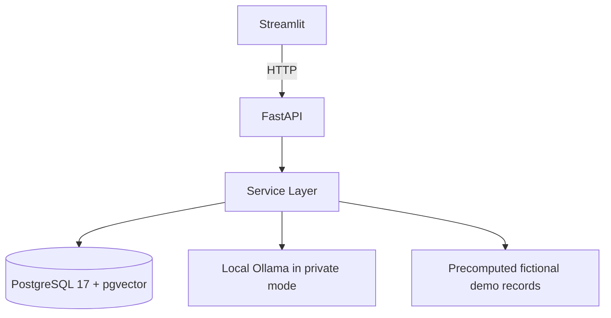

# Architecture

AI Job Hunter CRM uses a simple layered architecture:

## Layers

- **Streamlit** renders the product UI and calls FastAPI only.
- **FastAPI** owns route contracts, validation, mode reporting, and demo-mode write restrictions.
- **Services** own parsing, matching, embeddings, tailoring, application workflow, and demo seeding.
- **PostgreSQL 17 + pgvector** stores relational data, vectors, semantic results, and generated records.
- **Local Ollama** is optional and used only for private-mode live embedding/generation.

## Parsing

Candidate and job parsing are deterministic. They use a shared skill catalog, alias matching, explicit years-of-experience extraction, and basic education extraction. Parsers do not call LLMs and do not invent candidate qualifications.

## Deterministic Scoring

The deterministic scorer compares parsed candidate and job records using required skills, preferred skills, experience, and education. Applicable weights are renormalized and rounded deterministically.

## Embeddings and Semantic Matching

Embedding sources are built from stored candidate/job fields and hashed with SHA-256. Semantic similarity is stored separately from deterministic match results. It is not blended into a hybrid score.

## Tailoring

Tailoring uses structured provider output, evidence validation, and source/context hashes. Resume bullets require supporting evidence that appears in the stored candidate résumé text.

## Application Tracking

Applications link candidates to jobs, enforce one candidate-job pair per application, and store status history for `saved`, `applied`, `interview`, `rejected`, and `offer`.

## Mode Enforcement

`APP_MODE=local` is writable. `APP_MODE=demo` is read-only for public HTTP routes. The backend exposes `/app-info` so the frontend can display the authoritative mode. Demo-mode write protection lives in FastAPI dependencies, not only in the frontend.

## Demo Seeding

Demo seed/reset uses stable versioned keys on root records: candidates, jobs, and applications. Dependent records are rebuilt through relationships and cascades. Shared skills are canonical and are not marked as demo-owned.

## Docker Services

- `postgres`: `pgvector/pgvector:0.8.3-pg17-trixie`
- `backend`: waits for DB, runs Alembic, optionally seeds demo, starts Uvicorn
- `frontend`: Streamlit dashboard pointed at `http://backend:8000`

Demo Docker uses a separate database and volume from local/private mode.
